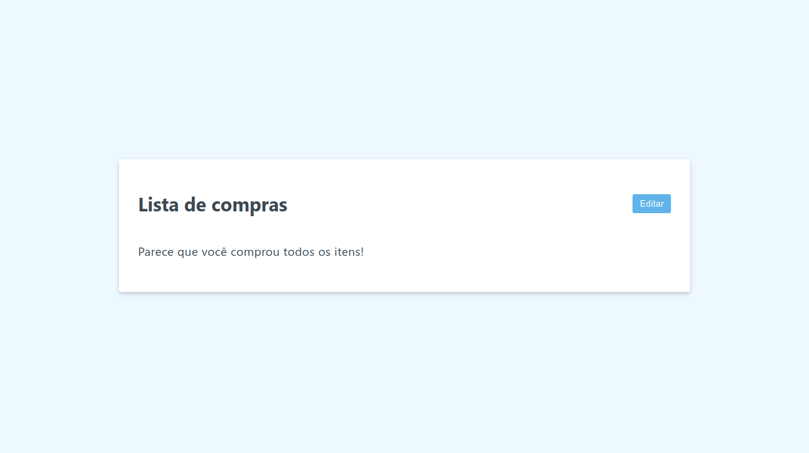

<!-- 

   -->

# Vue 3 Fundamentals (Options API)

Concept learning project for beginners in the Vue.js framework.

## Features

- Edit list
- Save items
- Mark as done
- Change priority

## Screenshots

## Learnings

I am sure that with these projects I was able to improve my skills. I was able to learn:

- Vue dev tools
- Template Syntax and Expressions
- List Rendering
- Inputs
- Events
- Methods
- Conditional rendering
- Bind
- Dynamic classes
- Computed

## References

 - [Vue.js 3 Fundamentals with the Options API](https://vueschool.io/courses/vuejs-3-fundamentals)
 

## License

[MIT](LICENSE)

## Authors

- [@viniciuscosta](https://www.github.com/jolonte)